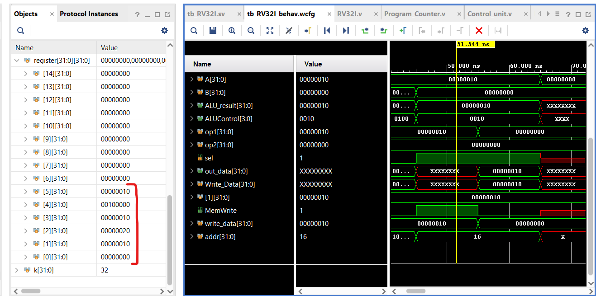

# SingleCycle_RV32I
Verilog Implementation of RISC-V RV32I Instruction Set Architecture

1. ADDI x1, x0, 0x10  -> x1 = 0x10
2. ADDI x2, x1, 0x10 -> x2 = 0x20 
3. SUB x3, x2, x1 -> x3 = 0x10
4. SLL x4, x3, x1 -> x4 = 0x00100000
5. SW x3, 0(x1) -> Mem[x1 + 0] = x3
6. LW x5, 0(x4) -> x5 = 0x10

